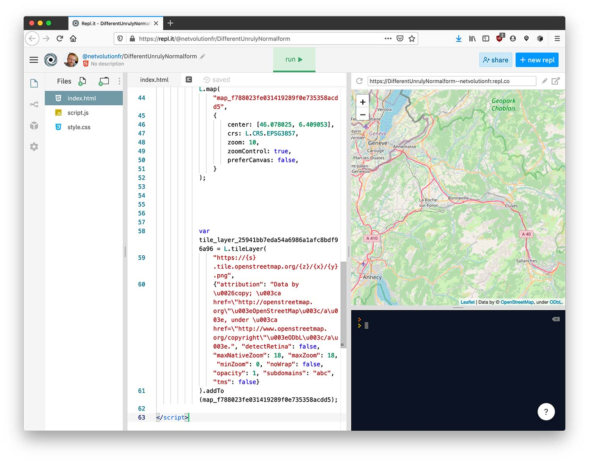

# 2. Générer la carte

Voici le code permettant de générer la carte en Python :

```python
import folium

c = folium.Map(location=[46.078025, 6.409053])
c.save('maCarte.html')
```

Lorsqu'on lance ce programme, on voit un nouveau fichier "maCarte.html" qui s'affiche.

Par contre, il est uniquement possible de voir le code source.

Afin d'afficher la carte dans un navigateur, il faut créer un nouveau projet Repl.it de type HTML, ouvrir le fichier
index.html, puis copier / coller le code depuis le projet Python vers le projet HTML.

Vous devriez voir apparaître la carte générée :


