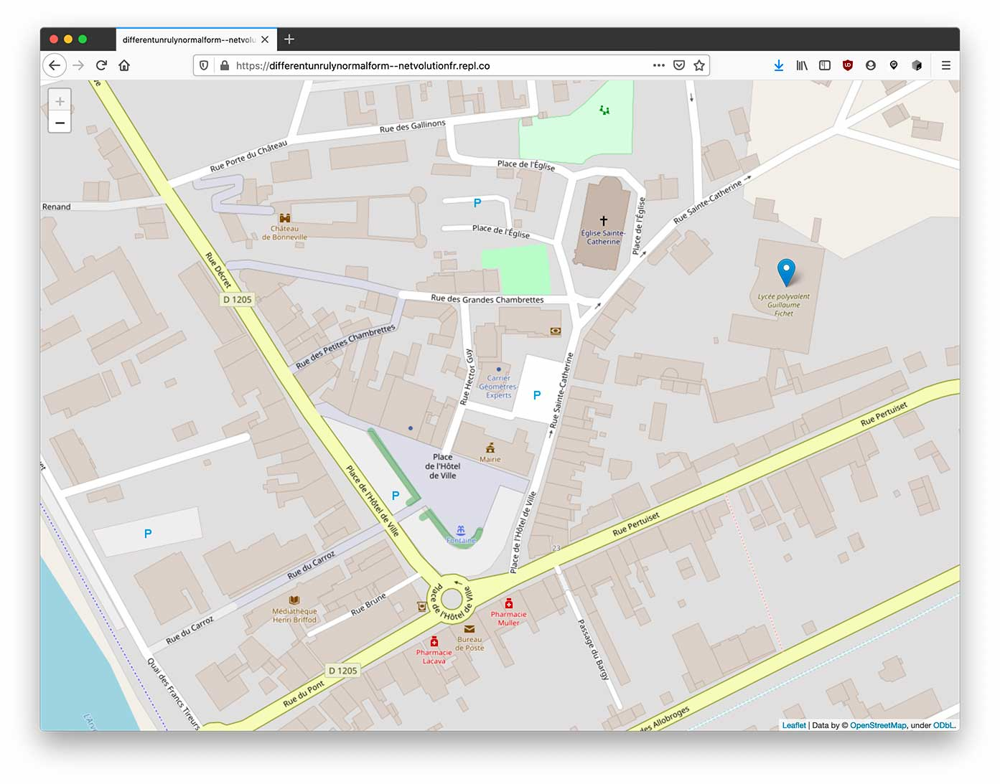

# 6. Ajouter une Popup au marqueur

Afin de finaliser le code, vous allez ajouter une popup au marqueur.

Modifiez le code suivant pour qu'il corresponde au lycée St Joseph à Boulogne-sur-Mer :

```python
import folium
c= folium.Map(location=[46.078025, 6.409053],zoom_start=20)
folium.Marker([46.078637266899,  6.4111924884134],popup="Lycée G Fichet").add_to(c)
c.save('maCarte.html')
```


